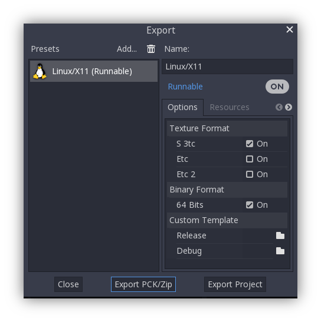

.. _doc_content_hosting:

Hosting your projects
=====================

To host your project, first you need to make sure it's compatible with `Godot Engine 4.5`_.

And set rendering method as ``Forward+``.

.. _Godot Engine 4.5: https://godotengine.org/download/

Exporting
---------

| Then you need to create some files. Download and check out the `demo project`_ as an example.
| 
| 1. Export your project as a pack file **\(zip preferred\)**. See Godot documentation on `exporting packs`_.

| 2. Create thumbnail image **\(png, 16:9 preferred\)**.
| 
| 3. Create gate file as shown below.

.. code-block:: toml

   # your_project.gate
   [gate]

   title="Your project name"
   description="This will be in search"
   icon=""
   image="path/image.png"
   resource_pack="path/pack.zip"
   godot_version="4.5"

   # 'path' relative to your gate file
   # or absolute url

| After doing this, you will have 3 files: **project pack**, **thumbnail image**, **gate file**.

.. note:: 

   | You can use `TheGates Export Plugin`_ that creates everything for you.

.. _demo project: https://drive.google.com/file/d/1Vhf-NlfKl3oCEglXQRu3TP1yOdlPUMrF/view
.. _exporting packs: https://docs.godotengine.org/en/stable/tutorials/export/exporting_pcks.html
.. _TheGates Export Plugin: https://godotengine.org/asset-library/asset/2882

Hosting on a server
-------------------

| Now you are ready to host your project and open it in TheGates.
| 
| To test it locally, use `python SimpleHttpServer`_ or `Servez`_.
| 
| Just start your server, type the gate file URL in `TheGates app`_, and voilà.
| Example: ``http://localhost:8000/your_project.gate``

.. _python SimpleHttpServer: https://www.hackerearth.com/practice/notes/simple-http-server-in-python/
.. _Servez: https://greggman.github.io/servez/
.. _TheGates app: https://thegates.io/

.. note::

   | If you have any difficulties ask the :ref:`community <doc_content_community>`.
   | To host on our server email us on thegates.browser@gmail.com
   | 
   | * Further steps are optional and not required.

Linking
-------

To make a user follow a link to another gate, call from GDScript:

.. code-block:: python

   if get_tree().has_method("send_command"):
      get_tree().send_command("open_gate", ["https://example.com/project.gate"])

See more in :ref:`doc_engine_commands`.

GDExtension
-----------

To load GDExtension shared libraries:

* Copy the GDExtension file section **\[libraries\]** to the gate file.

* Edit paths to match their relative URL paths.

.. code-block:: toml

   # your_project.gate
   [gate]
   title="GDExtension project"
   description="This should work"
   image="path/image.png"
   resource_pack="path/pack.zip"

   [libraries]
   linux.debug.x86_64 = "path/your.so"
   linux.release.x86_64 = "path/your.so"
   windows.debug.x86_64 = "path/your.dll"
   windows.release.x86_64 = "path/your.dll"
   macos.debug = "path/your.dylib"
   macos.release = "path/your.dylib"
   macos.debug.arm64 = "path/your.dylib"
   macos.release.arm64 = "path/your.dylib"

   # 'path' relative to your gate file
   # or absolute url

.. warning:: 

   | **Windows**, **Linux**, and **macOS** libraries required.
   | **Debug** and **Release** are also required \(can be the same file\).
