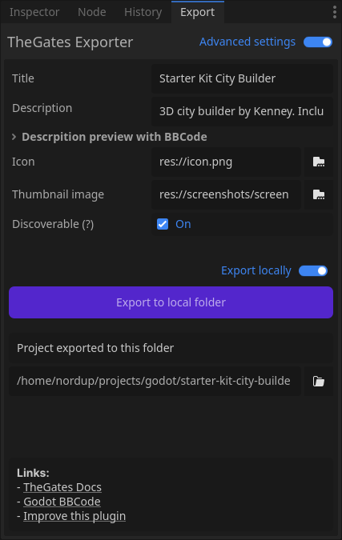

.. _doc_hosting:

Hosting your projects
=====================

| This guide covers how to export your project and serve exported files over HTTP
  using widely-used web server software Nginx.

Export locally from the plugin
------------------------------

1. Open the TheGates export plugin in Godot.
2. Toggle ``Advanced settings``.
3. Enable ``Export locally`` and click ``Export to local folder``.

| *Plugin preview when exporting to a local folder*

Make a note of the export output directory on your machine. You will
upload its contents to your server in a later step.

Get a server and connect via SSH (very short)
--------------------------------------------

- You can use any VPS provider (for example: `DigitalOcean Droplets
  <https://docs.digitalocean.com/products/droplets/how-to/create/>`__,
  `Hetzner Cloud <https://docs.hetzner.com/cloud/>`__,
  `AWS Lightsail <https://lightsail.aws.amazon.com/>`__).
- Learn SSH basics if needed: `SSH tutorial
  <https://www.ssh.com/academy/ssh/command>`__.

Once the server is created, connect to it from your terminal:

.. code-block:: bash

  ssh username@your_server_ip

Replace ``username`` and ``your_server_ip`` with your server's values.

Install Nginx
-------------

You can install Nginx on various operating systems. Here's how to install it on Ubuntu:

.. code-block:: bash

  sudo apt update
  sudo apt install -y nginx

Enable and start the service:

.. code-block:: bash

  sudo systemctl enable nginx
  sudo systemctl start nginx

If a firewall is enabled, allow HTTP (and HTTPS if you later add TLS):

.. code-block:: bash

  # Ubuntu/Debian with ufw
  sudo ufw allow 'Nginx Full' || sudo ufw allow 80

Upload your exported files to the server
---------------------------------------

Create a directory to host your game files (adjust path as desired):

.. code-block:: bash

  sudo mkdir -p /var/www/thegates/my-game
  sudo chown -R "$USER":"$USER" /var/www/thegates/my-game

From your local machine (where you exported), upload the contents of
the export folder to the server path above. You can use ``scp`` or
``rsync`` for this:

.. code-block:: bash

  # From your local machine
  # Replace /path/to/exported_folder with the folder created by the plugin
  scp -r /path/to/exported_folder/* username@your_server_ip:/var/www/thegates/my-game/

  # Or with rsync (resumes and only copies changes)
  rsync -avz /path/to/exported_folder/ username@your_server_ip:/var/www/thegates/my-game/

Configure Nginx to serve the files
----------------------------------

Create a new Nginx server block. On Debian/Ubuntu, place it in
``/etc/nginx/sites-available/thegates.conf`` and symlink to
``sites-enabled``. On other distros, use ``/etc/nginx/conf.d/thegates.conf``.

.. code-block:: bash

  # Debian/Ubuntu style
  sudo nano /etc/nginx/sites-available/thegates.conf

Example configuration suitable for TheGates exports:

.. code-block:: nginx

  server {
      listen 80;
      # Replace with your domain or keep _ for any host
      server_name _;

      # Path to the uploaded export files
      root /var/www/thegates/my-game;
      index index.html;

      # Serve files if present, otherwise 404
      location / {
          try_files $uri $uri/ =404;
      }

      # Ensure correct MIME types for Godot/WebAssembly assets
      types {
          application/wasm  wasm;
          application/octet-stream  pck;
      }

      # Cache immutable static assets aggressively
      location ~* \.(?:wasm|pck|js|mjs|css|png|jpg|jpeg|webp|svg|gif|ico|ttf|otf|woff|woff2|mp3|ogg|mp4)$ {
          access_log off;
          add_header Cache-Control "public, max-age=31536000, immutable";
      }

      # Keep HTML relatively fresh (don't cache for long)
      location = /index.html {
          add_header Cache-Control "no-cache";
      }
  }

If you used the Debian/Ubuntu layout, enable the site and test:

.. code-block:: bash

  sudo ln -s /etc/nginx/sites-available/thegates.conf /etc/nginx/sites-enabled/thegates.conf
  sudo nginx -t
  sudo systemctl reload nginx

For distros using ``conf.d``:

.. code-block:: bash

  sudo nginx -t
  sudo systemctl reload nginx

Verify in the browser
---------------------

Open ``http://your_domain`` or ``http://your_server_ip`` in your
browser. You should see the exported TheGates page load and assets
download correctly (including ``.wasm`` and ``.pck`` files).

Next steps (optional)
---------------------

- Add HTTPS with Let's Encrypt: `Certbot Nginx guide
  <https://certbot.eff.org/instructions>`__.
- Set a custom domain and DNS A record with your provider.
- Automate uploads with CI and ``rsync``.
