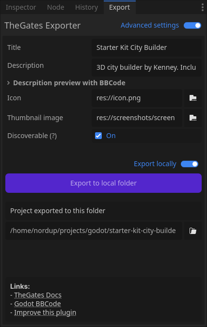

.. _doc_hosting:

Hosting your projects
=====================

| A gate is a few static files: a ``.gate`` manifest, a ``.pck`` or
  ``.zip`` resource pack, and a couple of images. Any HTTP server can
  serve them. This guide shows the simplest reliable path: a Linux VPS
  running Caddy, which is a single-binary web server with automatic
  HTTPS and a three-line config.

Export locally from the plugin
------------------------------

1. Open the TheGates export plugin in Godot.
2. Toggle ``Advanced settings``.
3. Enable ``Export locally`` and click ``Export to local folder``.

| *Plugin preview when exporting to a local folder*

Make a note of the export output directory. You will upload its contents
to your server in a later step.

Get a server
------------

You can follow this guide two ways. With a domain you get HTTPS and a
shareable URL; with just the server's IP you can test in a few minutes
without buying anything.

**With a domain (recommended)**

- Rent a VPS, for example `DigitalOcean Droplets
  <https://docs.digitalocean.com/products/droplets/how-to/create/>`__,
  `Hetzner Cloud <https://docs.hetzner.com/cloud/>`__, or `AWS Lightsail
  <https://lightsail.aws.amazon.com/>`__.
- Point a DNS ``A`` record from your domain at the server's IP. Your
  registrar's docs cover this; here is a `generic overview
  <https://www.cloudflare.com/learning/dns/dns-records/dns-a-record/>`__.
- SSH into the server:

.. code-block:: bash

  ssh username@your_server_ip

**IP only (quick test)**

- Rent a VPS as above; skip the domain.
- SSH in with the same command. You will serve over plain ``http://``
  for testing.

Install Caddy
-------------

The official `Caddy install instructions
<https://caddyserver.com/docs/install>`__ cover every distribution. On
Debian / Ubuntu:

.. code-block:: bash

  sudo apt install -y debian-keyring debian-archive-keyring apt-transport-https curl
  curl -1sLf 'https://dl.cloudsmith.io/public/caddy/stable/gpg.key' | sudo gpg --dearmor -o /usr/share/keyrings/caddy-stable-archive-keyring.gpg
  curl -1sLf 'https://dl.cloudsmith.io/public/caddy/stable/debian.deb.txt' | sudo tee /etc/apt/sources.list.d/caddy-stable.list
  sudo apt update
  sudo apt install -y caddy

Caddy starts as a systemd service automatically; nothing else to run.

Upload your exported folder
---------------------------

Create a directory for the gate on the server, then upload the export
from your local machine:

.. code-block:: bash

  # On the server:
  sudo mkdir -p /var/www/mygate
  sudo chown -R "$USER":"$USER" /var/www/mygate

  # From your local machine
  # (replace /path/to/exported with the plugin output folder):
  rsync -avz /path/to/exported/ username@your_server_ip:/var/www/mygate/

| ``scp -r`` works too if you do not have ``rsync`` installed.
  Re-running the same ``rsync`` command later is how you publish
  updates.

Tell Caddy to serve it
----------------------

Edit ``/etc/caddy/Caddyfile``:

.. code-block:: bash

  sudo nano /etc/caddy/Caddyfile

**With a domain:**

.. code-block:: caddyfile

  yourdomain.com {
      root * /var/www/mygate
      file_server
  }

**IP only:**

.. code-block:: caddyfile

  :80 {
      root * /var/www/mygate
      file_server
  }

Reload Caddy:

.. code-block:: bash

  sudo systemctl reload caddy

| For the domain variant, Caddy provisions a Let's Encrypt certificate
  the first time someone visits — HTTPS just works. Full reference: the
  `Caddyfile documentation <https://caddyserver.com/docs/caddyfile>`__.

Open in TheGates
----------------

Paste the gate URL into the TheGates app:

- ``https://yourdomain.com/yourproject.gate`` (with domain)
- ``http://your_server_ip/yourproject.gate`` (IP only)

| Replace ``yourproject.gate`` with the filename produced by the
  plugin.
