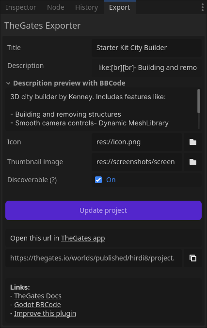

.. _doc_quickstart:

Quickstart
==========

| Follow this simple steps to publish your first project to TheGates.
  Or see the `video guide <https://www.youtube.com/watch?v=mBmzvQNlkfs>`__.

.. note::

  See :doc:`/getting-started/hosting` if you want to host your project on your own server.

Prerequisites
-------------

* Install `Godot Engine 4.5 <https://godotengine.org/download/>`__.
* Create a new Godot project or open your existing one.
* In your project, set the rendering method to ``Forward+``.
* Install the `TheGates Export`_ plugin from the Godot Asset Library.

.. _TheGates Export: https://godotengine.org/asset-library/asset/2882

Publish to TheGates
-------------------

1. Open the export plugin
2. Click "Publish to TheGates" (you can skip filling the fields)
3. Copy the provided URL and open it in `TheGates app`_
4. Share the URL with friends

| *\*Plugin preview after publishing and filling the fields*

.. _TheGates app: https://thegates.io/

Next steps
----------

* :doc:`/getting-started/hosting` in your own server.
* Follow :doc:`/getting-started/optional`.
* Join the :doc:`/community/community` for help and feedback.
