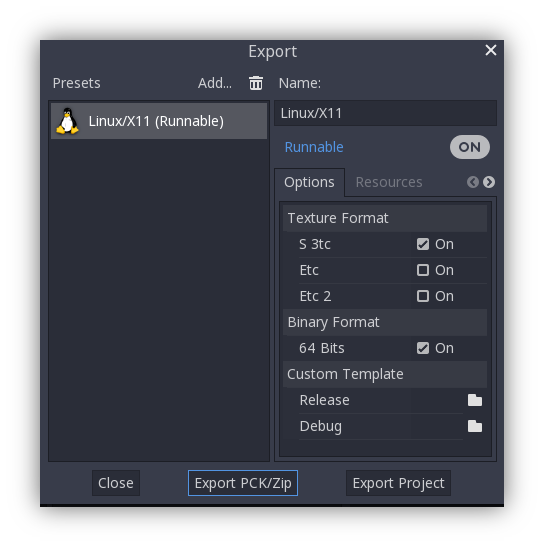

.. _doc_quickstart:

Quickstart
==========

| Export your Godot 4.5 project for TheGates: pack + ``.gate``, test locally, link worlds, optional GDExtension. Hosting: :ref:`doc_hosting`.

Prerequisites
-------------

* Install `Godot Engine 4.5 <https://godotengine.org/download/>`__.
* In your project, set the rendering method to ``Forward+``.

Start from the template
-----------------------

| Use the official multiplayer starter project with VOIP:

* GitHub: `thegatesbrowser/godot-multiplayer <https://github.com/thegatesbrowser/godot-multiplayer>`__

| Clone and open in Godot 4.5:

.. code-block:: bash

   git clone https://github.com/thegatesbrowser/godot-multiplayer.git
   cd godot-multiplayer

| The template includes:

* Third‑person controller with client interpolation
* Ready‑to‑use client/server multiplayer
* 3D positional voice chat (VOIP) and basic UI

Exporting
---------

| Then you need to create some files. Download and check out the `demo project`_ as an example.
| 
| 1. Export your project as a pack file **(zip preferred)**. See Godot documentation on `exporting packs`_.

| 2. Create thumbnail image **(png, 16:9 preferred)**.
| 
| 3. Create gate file as shown below.

.. code-block:: toml

   # your_project.gate
   [gate]

   title="Your project name"
   description="This will be in search"
   icon=""
   image="path_to/image.png"
   resource_pack="path_to/pack.zip"
   godot_version="4.5"

   # 'path' relative to your gate file
   # or absolute url

| After doing this, you will have 3 files: **project pack**, **thumbnail image**, **gate file**.

.. note:: 

   | You can use `TheGates Export Plugin`_ that creates everything for you.

.. _demo project: https://drive.google.com/file/d/1Vhf-NlfKl3oCEglXQRu3TP1yOdlPUMrF/view
.. _exporting packs: https://docs.godotengine.org/en/stable/tutorials/export/exporting_pcks.html
.. _TheGates Export Plugin: https://godotengine.org/asset-library/asset/2882

Test locally
------------

* Start a simple HTTP server in the folder with your ``.gate`` file.

.. code-block:: bash

   python3 -m http.server 8000

* In `TheGates app`_, open: ``http://localhost:8000/your_project.gate``.

| Alternatively, you can use `Servez`_.

.. _Servez: https://greggman.github.io/servez/
.. _TheGates app: https://thegates.io/

Link to other worlds
--------------------

| To make a user follow a link to another gate, call from GDScript:

.. code-block:: python

   if get_tree().has_method("send_command"):
      get_tree().send_command("open_gate", ["https://example.com/project.gate"])

| See more in :ref:`doc_command_channel`.

GDExtension (optional)
----------------------

| To load GDExtension shared libraries:

* Copy the GDExtension file section **[libraries]** to the gate file.

* Edit paths to match their relative URL paths.

.. code-block:: toml

   # your_project.gate
   [gate]
   title="GDExtension project"
   description="This should work"
   icon="path_to/icon.png"
   image="path_to/image.png"
   resource_pack="path_to/pack.zip"
   godot_version="4.5"

   [libraries]
   linux.debug.x86_64 = "path_to/yourlib.so"
   linux.release.x86_64 = "path_to/yourlib.so"
   windows.debug.x86_64 = "path_to/yourlib.dll"
   windows.release.x86_64 = "path_to/yourlib.dll"
   macos.debug = "path_to/yourlib.dylib"
   macos.release = "path_to/yourlib.dylib"
   macos.debug.arm64 = "path_to/yourlib.dylib"
   macos.release.arm64 = "path_to/yourlib.dylib"

   # 'path' relative to your gate file
   # or absolute url

.. warning:: 

   | **Windows**, **Linux**, and **macOS** libraries required.
   | **Debug** and **Release** are also required (can be the same file).

Next steps
----------

* Deploy to the web: :ref:`doc_hosting`.
* Use engine commands: :ref:`doc_command_channel`.
* Join the :ref:`doc_community` for help and feedback.
